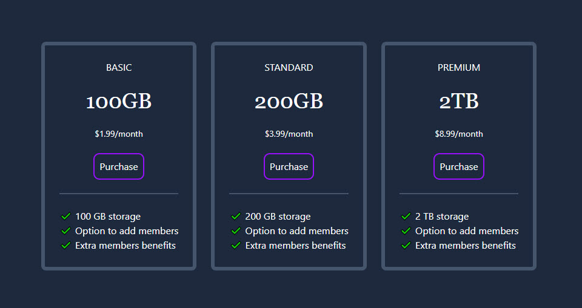
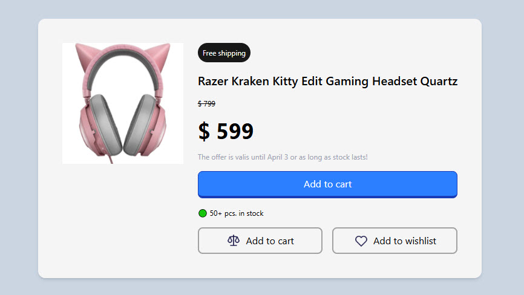
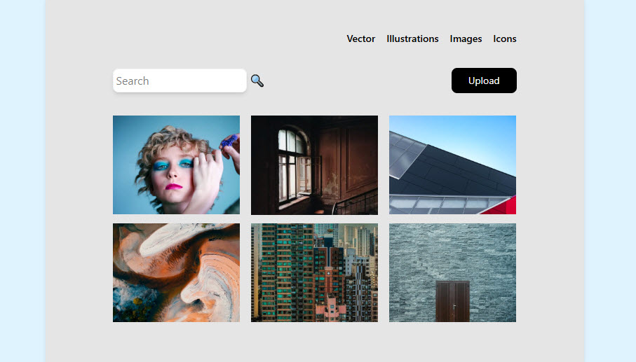
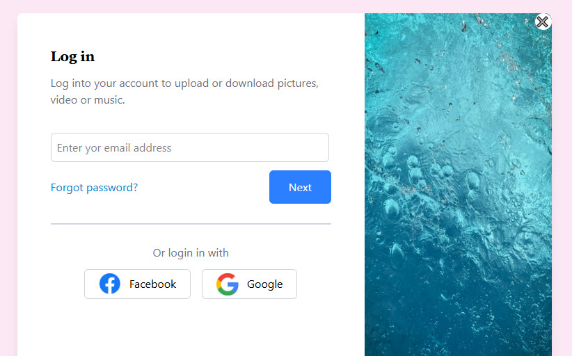

# tailwind-packt-mini-projects
Mini projects for course Tailwind CSS From Scratch - Packt

### Project 1 - Email subscribe card

  

### Project 2 - Pricing grids

  

### Project 3 - Product modal

  

### Project 4 - Image gallery

  

### Project 5 - Login modal

  

